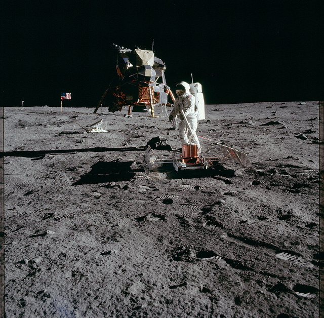

Flickr Apollo Archive
=====================

|Build| |Coverage| |PyPI| |Status| |Version| |Python| |License| |Tutorial|

.. |Build| image:: https://travis-ci.org/seignovert/python-flickr-apollo-archive.svg?branch=master
        :target: https://travis-ci.org/seignovert/python-flickr-apollo-archive
.. |Coverage| image:: https://coveralls.io/repos/github/seignovert/python-flickr-apollo-archive/badge.svg?branch=master
        :target: https://coveralls.io/github/seignovert/python-flickr-apollo-archive?branch=master
.. |PyPI| image:: https://img.shields.io/badge/PyPI-apollo--archive-blue.svg
        :target: https://pypi.org/project/apollo-archive
.. |Status| image:: https://img.shields.io/pypi/status/apollo-archive.svg?label=Status
        :target: https://pypi.org/project/apollo-archive
.. |Version| image:: https://img.shields.io/pypi/v/apollo-archive.svg?label=Version
        :target: https://pypi.org/project/apollo-archive
.. |Python| image:: https://img.shields.io/pypi/pyversions/apollo-archive.svg?label=Python
        :target: https://pypi.org/project/apollo-archive
.. |License| image:: https://img.shields.io/pypi/l/apollo-archive.svg?label=License
        :target: https://pypi.org/project/apollo-archive
.. |Tutorial| image:: https://img.shields.io/badge/Jupyter%20Notebook-tutorial-blue.svg
        :target: https://nbviewer.jupyter.org/github/seignovert/python-flickr-apollo-archive/blob/master/apolloarchive.ipynb

Python package to list and download all original images from
`Flickr Apollo Archive <https://www.flickr.com/photos/projectapolloarchive>`_.

|Moon|

`Project Apollo Archive <https://www.flickr.com/photos/projectapolloarchive/>`_
/
`Apollo 11 Magazine 40/S (v1 / levels-adj) <https://www.flickr.com/photos/projectapolloarchive/sets/72157658601662068/>`_
/
`AS11-40-5949 <https://www.flickr.com/photos/projectapolloarchive/21660108915/in/album-72157658601662068/>`_

Install
-------
With ``pip``:

.. code:: bash

    $ pip install apollo-archive

With the ``source files``:

.. code:: bash

    $ git clone https://github.com/seignovert/python-flickr-apollo-archive.git apollo-archive
    $ cd apollo-archive ; python setup.py install

.. note::

    You need FlickrAPI ``key`` and ``secret`` tokens. They can be generated `here <https://www.flickr.com/services/api/keys/>`_.

    Use the prompt input to init the key variables on the first load of the module:

    .. code:: bash

        Warning: Some environnement variables are missing.
        > Go to https://www.flickr.com/services/api/keys/ to setup your keys.
        FLICKR_API_KEY: 1234567890
        FLICKR_API_SECRET: ABCDEF

    or you can set then globally:

    .. code:: bash

        $ export FLICKR_API_KEY=1234567890
        $ export FLICKR_API_SECRET=ABCDEF

Python usage
------------
Query Flickr API:

.. code:: python

    >>> from apolloarchive import User

    >>> user = User()
    Flickr User: Apollo Image Gallery (136485307@N06) | 107 albums

    >>> albums = user.albums
    [
        Album: "Announcements" (3 photos),
        Album: "Apollo 7 Magazine 3/M" (46 photos),
        Album: "Apollo 7 Magazine 4/N" (55 photos),
        ...
        Album: "Apollo 17 Magazine 163/TT" (72 photos)
    ]

    >>> albums[0].slug
    'Announcements'

    >>> albums[0].photos
    [
        Photo: "(also) Follow Project Apollo Archive on Facebook",
        Photo: "About the Project Apollo Archive Flickr Gallery",
        Photo: "The Project Apollo Archive is best experienced in the "Albums" view"
    ]

    >>> albums[0].photos[0].url
    'https://farm1.staticflickr.com/622/21878909302_a369c0c4de_o.jpg'

    >>> albums[0].photos[0].filename
    'Also-follow-project-apollo-archive-on-facebook.jpg'

Sync Flickr photosets:

.. code:: python

    >>> from apolloarchive import sync

    >>> sync(album=0, ncpu=4, overwrite=True)
    Sync Announcements: 100%|█████████████████████████| 3/3 [00:00<00:00,  3.89it/s]
    > Download: Also-follow-project-apollo-archive-on-facebook
    > Download: About-the-project-apollo-archive-flickr-gallery
    > Download: The-project-apollo-archive-is-best-experienced-in-the-albums-view

CLI usage
---------
Sync Flickr photosets:

.. code:: bash

    $ apollo-archive --help
    usage: apollo-archive [-h] [--user-id USER_ID] [--username USERNAME]
                          [--album ALBUM] [--ncpu NCPU] [--overwrite]

    Sync Flickr folder(s)

    optional arguments:
      -h, --help                       show this help message and exit
      --user-id USER_ID, -i USER_ID    User ID
      --username USERNAME, -u USERNAME Username
      --album ALBUM, -a ALBUM          Album number to sync
      --ncpu NCPU, -n NCPU             Number of thread during for download
      --overwrite, -o                  Re-download all

    $ apollo-archive --album 0 --ncpu 4 --overwrite
    Sync Announcements: 100%|█████████████████████████| 3/3 [00:00<00:00,  3.89it/s]
    > Download: Also-follow-project-apollo-archive-on-facebook
    > Download: About-the-project-apollo-archive-flickr-gallery
    > Download: The-project-apollo-archive-is-best-experienced-in-the-albums-view

.. warning:: The complete archive is **very large** (~62 Gb).

Dependencies
------------
- flickrapi
- python-slugify
- wget
- tqdm
- argparse

Disclaimer
----------
This project is not supported or endorsed by either JPL or NASA.
The code is provided "as is", use at your own risk.
